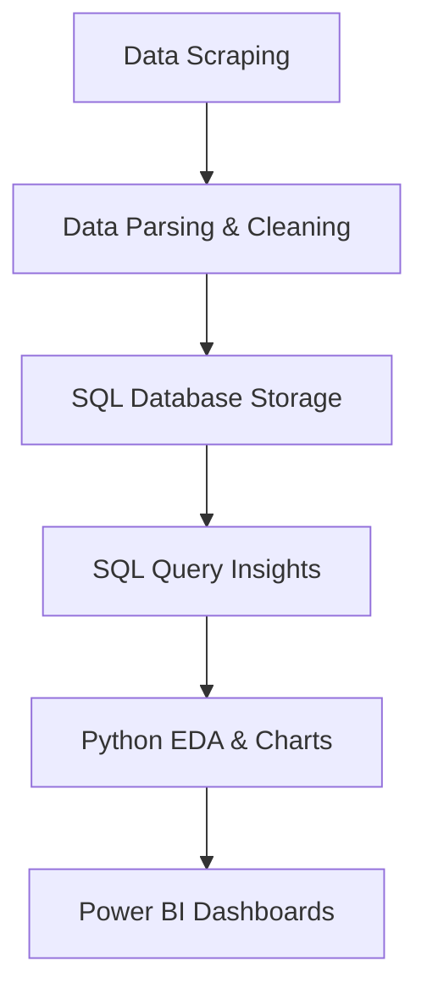

# Cricsheet Match Analysis Project 🏏

A complete end-to-end cricket match data analysis project that automates data collection from Cricsheet, processes and stores structured data in a SQL database, performs Python-based EDA, and visualizes insights interactively using Power BI.

 

## Project Overview

This project analyzes historical cricket match data (Test, ODI, T20, IPL) to uncover player and team insights using data engineering and data visualization techniques.

### Objective

- Scrape cricket match data from [Cricsheet](https://cricsheet.org/)
- Process and clean data using Python & Pandas
- Store structured data in SQL tables (MySQL)
- Perform EDA and visualizations using Python (matplotlib, seaborn)
- Build interactive dashboards using Power BI

 

## Tools & Skills Used

| Category         | Tools/Technologies            |
|------------------|-------------------------------|
| Web Scraping     | `Selenium`                    |
| Data Processing  | `Python`, `Pandas`            |
| Database         | `MySQL`, `SQL`, `.env` config |
| Visualization    | `Matplotlib`, `Seaborn`, `Power BI` |
| Automation       | `Batch Insert`, `Clean-Up Pipelines` |

 

## Dataset Info

- **Source:** [Cricsheet.org](https://cricsheet.org/)
- **Match Formats:** IPL, T20I, ODI, Test Matches
- **Raw Format:** JSON (downloaded via Selenium)
- **Processed Format:** CSV and SQL Tables
- **Columns Include:** Teams, Venue, Match Winner, Batsman, Bowler, Runs, Over Number, Toss Decision, Player of Match, etc.

 

## Project Pipeline

 

---

### Power BI Dashboards

Power BI visualizes unique insights for each match type. Each page includes 4 interactive charts:

- IPL, ODI, T20I, and Test match dashboards with team performance, player stats, and match summaries  
- Slicers included for filtering by **season**, **venue**, or **team**, enabling dynamic interaction  
- Clear layout designed for non-technical stakeholders  

**[Download Power BI Dashboard (.pbix)](Cricsheet_Visual_Dashboard.pbix)**  
(Requires [Power BI Desktop](https://drive.google.com/file/d/11NzplZg9EUx-xDhk5Qw6uL8DwaCbQWJA/view?usp=drive_link))

 

---

### Project Presentation

Minimal Google Slides-style deck summarizing the entire flow — from web scraping to dashboards. Ideal for walkthroughs or showcasing on portfolios.

**[Download Project Presentation (.pptx)](https://docs.google.com/presentation/d/1a-E5x1QTZUsOZ1qCX8PWXXu8oS2U7Obc/edit?usp=sharing&ouid=100203989646111117568&rtpof=true&sd=true)**

---

### Project Flow  

1. **Run `scraper.py`** → Downloads match zip files and extracts JSON to `data/`  
2. **Run `json_parser.py`** → Cleans, structures, and generates 4 Excel files in `processed_data/`  
3. **Run `database.py`** → Creates SQL tables and inserts cleaned data (IPL, ODI, T20, Test)  
4. **Run `sql_queries.ipynb`** → Analyze structured data with SQL queries  
5. **Run `cricket_insights.ipynb`** → Generate Python EDA charts using matplotlib & seaborn  
6. **Open Power BI** → Connect to SQL using ODBC and build interactive dashboards  

---
 

### Key Takeaways

1. Strengthened skills in Python-based preprocessing and EDA
2. Gained experience with scraping structured cricket data
3. Understood how to connect SQL to Power BI (ODBC)
4. Created interactive dashboards with clear visual storytelling
5. Navigated debugging issues with persistence and confidence

 

#### Thank You!
Feel free to fork, explore, and suggest improvements!